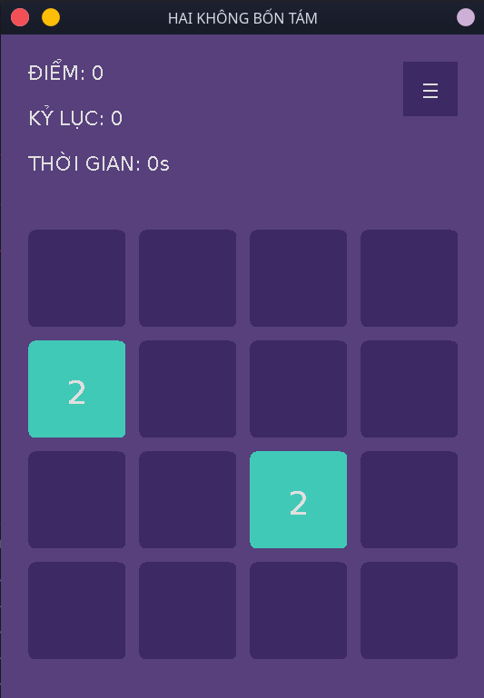
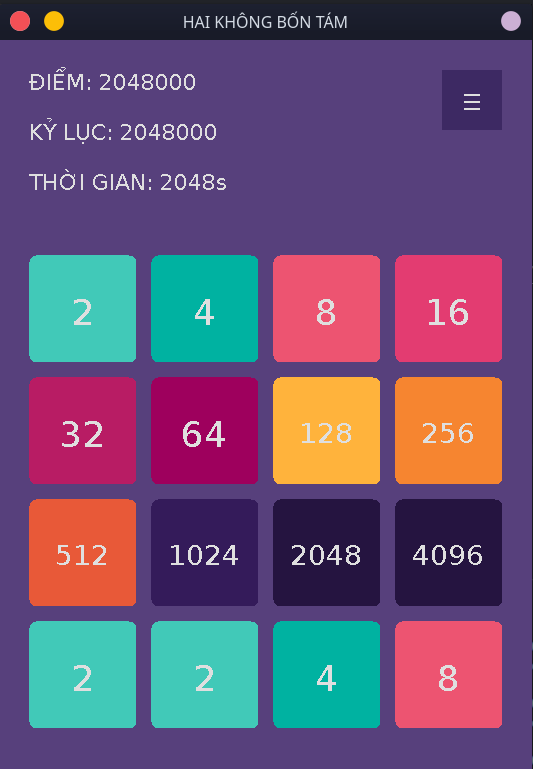

# Hai Không Bốn Tám - Yet another 2048 clone
A small clone of [2048](https://github.com/gabrielecirulli/2048) written in Java for my school project.  
There are comments _everywhere_ because at the time I was a _noob_. Still, even now 😢.

## How to play
Use your __WASD__ or __arrow keys__ to move the tiles. When two tiles with the same number touch, they __merge into one__! Try to reach 2048!

## Features
- No internet-connection is required 🐧
- Process and high-score will be automatically saved
- Leaderboard
- Endless mode (continue the game after reaching 2048)
- Oldschool 8-bit NES sound
- Easy to play with easy controls, a perfect time killer

It's a [2048](https://github.com/gabrielecirulli/2048) clone, what did you expect?

## Technology Stack
- [Java](https://www.java.com/en/)
- [OpenJDK](https://openjdk.java.net/)
- Microsoft's [Visual Studio Code](https://code.visualstudio.com/)

Plus a bunch of awesome VSCode extensions and other goodies.

## Screenshots

  
  

Might be _slightly_ different depends on your device.
